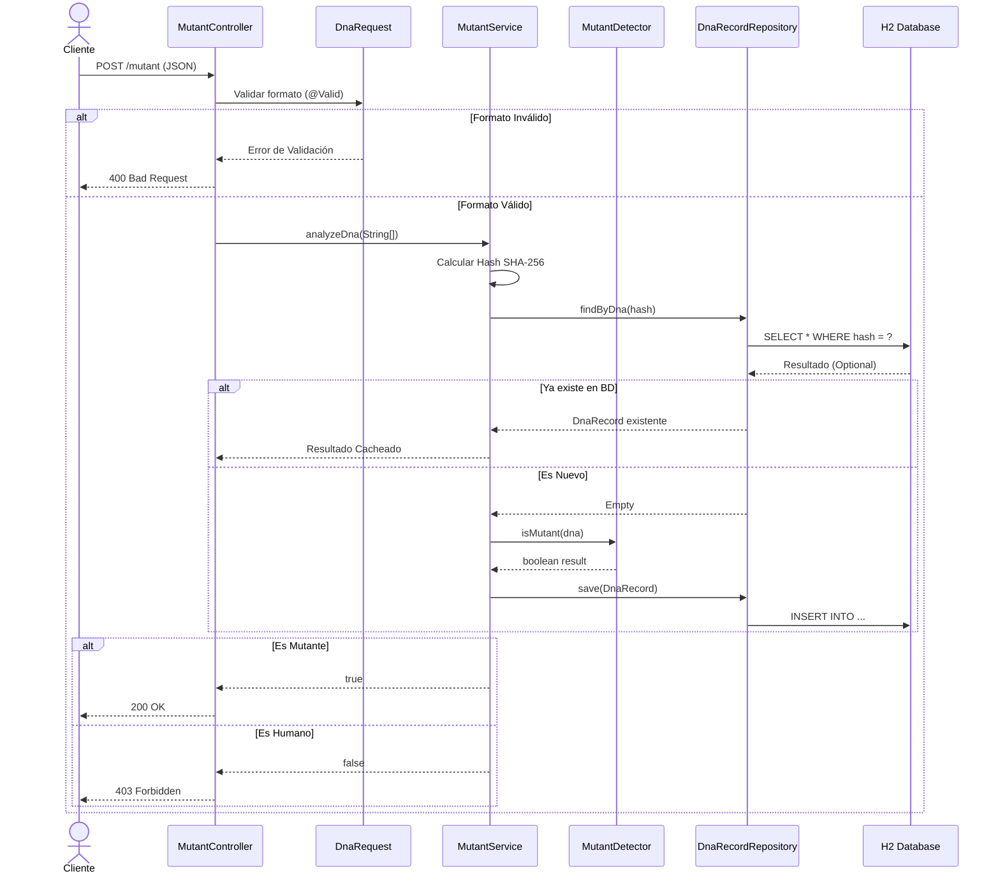
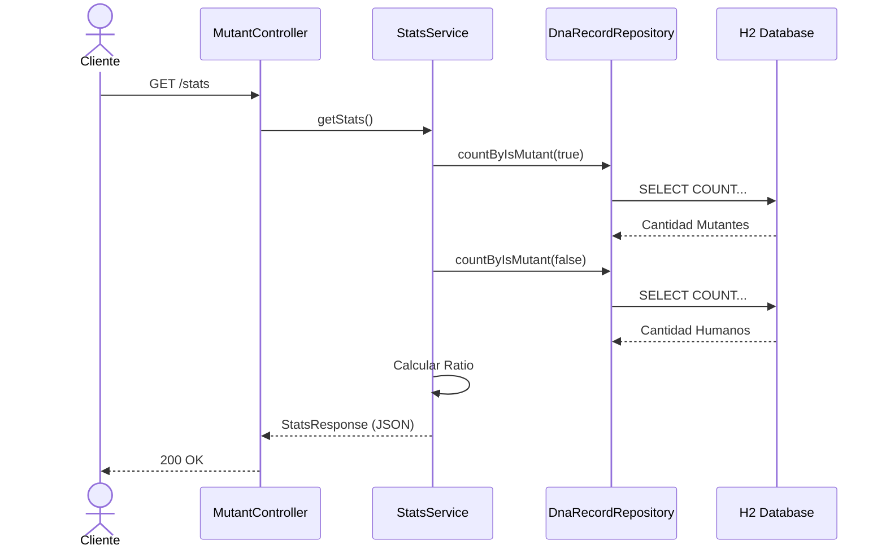

# 🧬 Mutant Detector API

API REST para detectar mutantes basándose en su secuencia de ADN. Proyecto desarrollado para el examen técnico de MercadoLibre.

[](https://www.oracle.com/java/)
[](https://spring.io/projects/spring-boot)
[]()

## 📋 Descripción

Magneto quiere reclutar la mayor cantidad de mutantes para su ejército. Este sistema permite detectar si un humano es mutante analizando su secuencia de ADN mediante una matriz de (NxN).

**Criterio de aceptación:**
Un humano es considerado **mutante** si se encuentran **más de una secuencia de cuatro letras iguales**, de forma oblicua, horizontal o vertical.

## 🚀 Cómo ejecutar el proyecto

### Prerrequisitos
* Java 17 (JDK)
* Gradle (incluido en el wrapper)

### Pasos
1.  **Clonar el repositorio:**
    ```bash
    git clone <TU_URL_DEL_REPO>
    cd ExamenMercado
    ```

2.  **Ejecutar la aplicación:**
    Desde la terminal (en la raíz del proyecto):
    ```bash
    ./gradlew bootRun
    ```
    *(En Windows usar `.\gradlew bootRun`)*

    La API iniciará en: `http://localhost:8080`

3.  **Ejecutar los Tests y ver Cobertura:**
    ```bash
    ./gradlew test jacocoTestReport
    ```
    El reporte de cobertura estará disponible en: `build/reports/jacoco/test/html/index.html`

## 🔗 Documentación de la API (Swagger)

Una vez iniciada la aplicación, puedes ver la documentación interactiva y probar los endpoints directamente en:

👉 **http://localhost:8080/swagger-ui.html**

---

## 📡 Endpoints Disponibles

### 1. Detectar Mutante
* **URL:** `/mutant`
* **Método:** `POST`
* **Descripción:** Detecta si un ADN pertenece a un mutante.

**Ejemplo Mutante (Retorna 200 OK):**
```json
{
    "dna": [
        "ATGCGA",
        "CAGTGC",
        "TTATGT",
        "AGAAGG",
        "CCCCTA",
        "TCACTG"
    ]
}
```

**Ejemplo Humano (Retorna 403 Forbidden):**
```json
{
    "dna": [
        "ATGCGA",
        "CAGTGC",
        "TTATTT",
        "AGACGG",
        "GCGTCA",
        "TCACTG"
    ]
}
```

### 2. Estadísticas
* **URL:** `/stats`
* **Método:** `GET`
* **Descripción:** Devuelve las estadísticas de verificaciones de ADN.

**Respuesta Ejemplo:**
```json
{
    "count_mutant_dna": 40,
    "count_human_dna": 100,
    "ratio": 0.4
}
```

---

## 💾 Base de Datos (H2)

El proyecto utiliza una base de datos en memoria H2 para almacenar los registros de ADN verificados.

* **Consola H2:** `http://localhost:8080/h2-console`
* **JDBC URL:** `jdbc:h2:mem:testdb`
* **User:** `sa`
* **Password:** *(dejar vacío)*

## 🏗️ Arquitectura

El proyecto sigue una arquitectura en capas:

1.  **Controller:** Maneja las peticiones HTTP (`MutantController`).
2.  **DTO:** Objetos de transferencia de datos con validaciones (`DnaRequest`).
3.  **Service:** Lógica de negocio y orquestación (`MutantService`, `StatsService`).
4.  **Domain/Model:** Algoritmo de detección (`MutantDetector`).
5.  **Repository:** Acceso a datos (`DnaRecordRepository`).
6.  **Entity:** Modelo de base de datos (`DnaRecord`).

## ✨ Características Extra
* **Optimización:** Algoritmo eficiente con *Early Termination* y manejo de matrices como `char[][]`.
* **Hash Único:** Se almacena el hash del ADN para evitar re-análisis de secuencias ya verificadas.
* **Validaciones:** `@ValidDnaSequence` personalizada para asegurar integridad de datos (NxN, caracteres válidos).

## 📐 Diagramas de Secuencia

### 1. Flujo de Detección (POST /mutant)


### 2. Flujo de Estadísticas (GET /stats)
